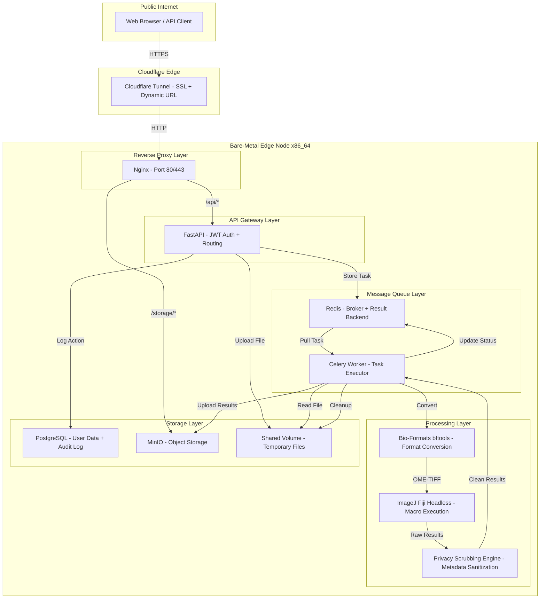
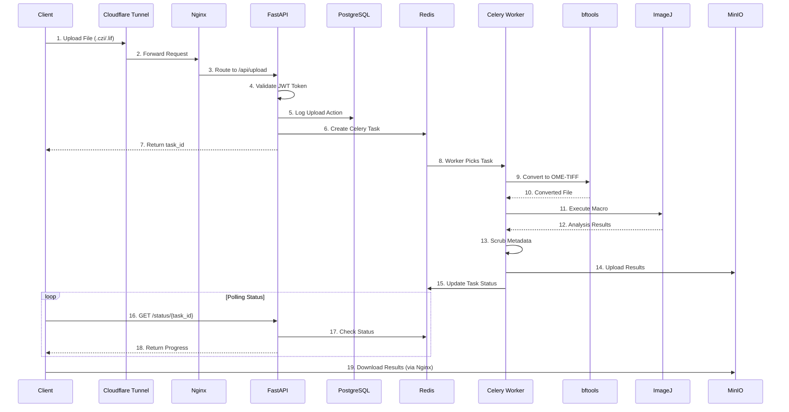
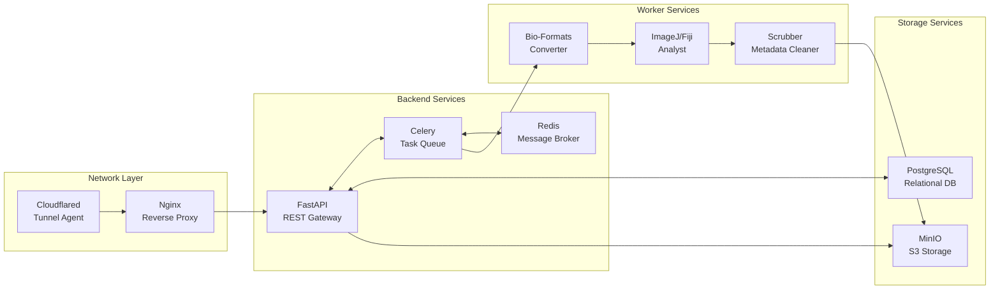

# 🔬 CloudScope: Decentralized Microscopy Analytics Platform


CloudScope adalah arsitektur backend modular berbasis **microservices** untuk mengonversi, memproses, dan mengorkestrasi analisis berkas citra mikroskopi multidimensi (seperti `.czi`, `.tif`, `.lif`).

Sistem ini didesain menggunakan prinsip komputasi *Bare-Metal Edge Node* untuk penelitian akar rumput. Komputasi berat dijauhkan dari ketergantungan korporasi cloud, memanfaatkan prosesor lokal x86 secara maksimal sambil tetap terhubung secara global melalui jaringan tepi (*Edge Tunneling*).

---

## Fitur Utama

| Fitur | Deskripsi |
|-------|------------|
| Headless Fiji Engine | Eksekusi makro ImageJ/Fiji (`.ijm`) kustom tanpa antarmuka grafis untuk efisiensi RAM |
| Dynamic Macro Registry | Pilihan makro dinamis (Standard, Cell Counting, Edge Detection) yang disuntikkan langsung via API |
| Format Agnostic | Integrasi `bftools` (Bio-Formats) untuk mengonversi format instrumen proprietary menjadi OME-TIFF standar |
| Privacy Scrubbing Engine | Penghapusan metadata instrumen sensitif dari berkas hasil analisis sebelum dipublikasikan |
| Edge-Cloud Tunneling | Akses global menggunakan Cloudflare Quick Tunnel tanpa konfigurasi router atau IP publik statis |
| Asynchronous Task Queue | Orkestrasi tugas berat dengan Celery dan Redis tanpa membebani Gateway API |

---

Berikut diagram alur data dalam format **Mermaid** yang dapat dirender langsung di GitHub, GitLab, atau editor Markdown yang mendukung Mermaid:

---

## Arsitektur & Alur Data

### Diagram Infrastruktur


### Alur Request Pengguna



### Komponen Sistem



---
## Technical Stack

### Backend Core


### Database & Storage


### Image Processing


### Infrastructure & Networking


---

## Prasyarat Sistem

| Persyaratan | Spesifikasi |
|-------------|-------------|
| Arsitektur CPU | x86_64 (Intel/AMD) - ARM tidak didukung karena stabilitas JVM |
| Memori (RAM) | Minimal 16 GB untuk host |
| Perangkat Lunak | Docker Engine ≥ 24.0, Docker Compose Plugin |
| Jaringan | Koneksi internet outbound aktif (tidak perlu port forwarding) |

---

## Instalasi & Konfigurasi

### 1. Kloning Repositori

```bash
git clone https://github.com/username-anda/cloudscope.git
cd cloudscope
```

### 2. Konfigurasi Lingkungan

Buat berkas `.env` dari contoh:

```bash
cp .env.example .env
```

Edit kredensial bawaan:

```env
# Database Credentials
POSTGRES_USER=admin
POSTGRES_PASSWORD=rahasia_komunitas
POSTGRES_DB=cloudscope

# MinIO Storage Credentials
MINIO_ROOT_USER=admin
MINIO_ROOT_PASSWORD=rahasia_komunitas

# Celery & Redis Configuration
CELERY_BROKER_URL=redis://cloudscope-redis:6379/0
CELERY_RESULT_BACKEND=redis://cloudscope-redis:6379/0
```

### 3. Persiapan Volume Bersama

```bash
sudo mkdir -p /tmp/cloudscope
sudo chmod 777 /tmp/cloudscope
```

### 4. Konfigurasi Pembatasan Sumber Daya

Di dalam `docker-compose.yml`, komponen worker dibatasi sumber dayanya:

```yaml
worker:
  deploy:
    resources:
      limits:
        memory: 4g
        cpus: "2"
```

---

## Eksekusi Deployment

### Menjalankan Seluruh Layanan

```bash
docker compose up -d --build --force-recreate
```

### Memeriksa Status Kontainer

```bash
docker compose ps
```

Pastikan kontainer inti berstatus `Up (healthy)`.

### Mengaktifkan Tunneling Publik

```bash
docker compose up -d quick-tunnel
```

### Mendapatkan URL Publik

```bash
docker compose logs quick-tunnel | grep "trycloudflare.com"
```

Output yang diharapkan:

```text
INF | Your quick Tunnel has been created! Visit it at:
INF | https://[nama-domain-acak].trycloudflare.com
```

---

## Monitoring & Telemetri

### Flower Dashboard (Monitoring Celery)

Akses `http://localhost:5555` untuk melihat:
- Metrik antrean
- Status worker
- Tugas sukses/gagal
- Waktu eksekusi real-time

### Pemantauan Sumber Daya

```bash
docker stats
```

### Investigasi Log Analitik

```bash
docker compose logs worker --tail 50
```

### Log Gateway dan Proxy

```bash
docker compose logs nginx
docker compose logs fastapi
```

---

## Panduan Interaksi API

### 1. Autentikasi Pengguna

```http
POST /api/auth/login
Content-Type: application/x-www-form-urlencoded

username=peneliti@example.com&password=Rahasia123!
```

Response:

```json
{
  "access_token": "eyJhbGciOiJIUzI1NiIs...",
  "token_type": "bearer"
}
```

### 2. Inisiasi Analisis Citra

```http
POST /api/upload/
Content-Type: multipart/form-data
Authorization: Bearer <token>

file: (file .czi / .tif)
project_id: "PROJECT_ALPHA"
macro_type: "PROJECT_CELLCOUNT"
```

Response:

```json
{
  "task_id": "550e8400-e29b-41d4-a716-446655440000",
  "status": "queued"
}
```

### 3. Pemantauan Status Tugas

```http
GET /api/status/{task_id}
Authorization: Bearer <token>
```

Response saat selesai:

```json
{
  "status": "SUCCESS",
  "result": {
    "csv_url": "/storage/results/task_id/data.csv",
    "metadata_url": "/storage/results/task_id/metadata.json"
  }
}
```

---

## Pemeliharaan Berkala

### Pembersihan Manual

```bash
chmod +x cleanup.sh
./cleanup.sh
```

### Otomatisasi dengan Cron (Produksi)

```bash
crontab -e
```

Tambahkan baris berikut:

```bash
0 2 * * 0 /path/ke/cloudscope/cleanup.sh >> /var/log/cloudscope_cleanup.log 2>&1
```

---

## Akses Layanan

| Layanan | URL Lokal | Keterangan |
|---------|-----------|-------------|
| Swagger UI (Dokumentasi API) | `http://localhost/api/docs` | Testing interaktif |
| MinIO Console | `http://localhost:9001` | Manajemen objek storage |
| Flower Dashboard | `http://localhost:5555` | Monitoring Celery |

---

## Kontribusi

Proyek ini dikembangkan untuk mendukung penelitian mandiri di lingkungan akademis dan komunitas. Kontribusi terbuka untuk:

- Laporan bug dan masalah keamanan
- Usulan fitur baru
- Pull request untuk optimasi worker dan peningkatan kode

Silakan buka issue atau pull request di repositori GitHub.

---

## Lisensi

Distribusikan di bawah lisensi **GNU General Public License**. Lihat berkas `LICENSE` untuk informasi lengkap.

---
